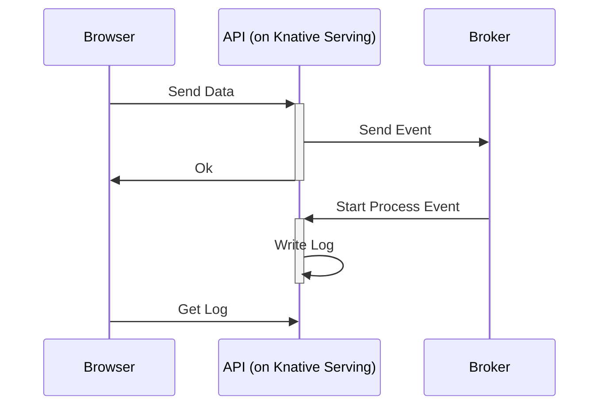

記錄一下在 k3s 上架設 Knative 並實際跑一個 API 服務在上面遇到的事情

(範例僅供參考，不保證都能正常運作)

<!--more-->

## API 服務介紹

先來介紹要在上面搭建什麼樣的 API 服務

1. 使用 Violentmonkey 在 A 網站上新增按鈕，此按鈕會將部分資料傳送給 API 服務
2. API 服務收到資訊後，先儲存資料，並把剩餘資訊打包成 Event 傳遞到 Broker 上 (可以想像成 Queue 那樣)
3. 同樣一組 API 服務收到 Event 後，開始處理資料，並上傳到 B 網站上
4. 提供 API 查詢目前的處理進度

下方提供簡略的循序圖


## 環境介紹

由於只是需要簡易的 Kubernetes 環境來跑 Knative  
這邊使用 [k3s](https://k3s.io/) 來架設，並只用一台機器來負責所有的事情


---
## Knative 安裝遇到的問題

這次使用 [Knative Operator](https://knative.dev/docs/install/operator/knative-with-operators/) 來安裝  
不過因為是第一次使用 Kubernetes & Knative，所以遇到不少狀況

### External Ip &lt;pending&gt;

在安裝 Knative Serving 過程中，安裝 Kourier 後  
發現 Kourier 的 `EXTERNAL-IP` 會一直是 \<Pending\>

```bash
kubectl --namespace knative-serving get service kourier
NAME      TYPE           CLUSTER-IP     EXTERNAL-IP    PORT(S)                      AGE
kourier   LoadBalancer   10.43.185.17   <Pending>      80:31950/TCP,443:32503/TCP   11d
```

上網 Google 很久找不到解決的方法，大概是因為會遇到這個狀況有太多種原因了

後來不確定在那邊看到，還是想到的，決定把 k3s 自帶的 traefik 給關閉

方法是再安裝一次時，帶上參數關閉 traefik
```bash
curl -sfL https://get.k3s.io | INSTALL_K3S_EXEC="--disable traefik" sh
```

最後 Kourier 的 `EXTERNAL-IP` 就會出來

不確定是不是真的衝突，還是說因為我是用單一機器的關係  
或許也有方法可以相容？

### Yaml 設定互相覆蓋

這邊算是不熟悉 Kubernetes 鬧出的笑話

本來一開始建立一個檔案 `knative-serving.yaml`
```yaml
apiVersion: operator.knative.dev/v1beta1
kind: KnativeServing
metadata:
  name: knative-serving
  namespace: knative-serving
spec:
  ingress:
    kourier:
      enabled: true
  config:
    network:
      ingress-class: "kourier.ingress.networking.knative.dev"
```

然後執行 `apply`
```bash
kubectl apply -f knative-serving.yaml
```

然後看到後面步驟說可以設定 domain ，就建立 `knative-serving-domain.yaml`
```yaml
apiVersion: operator.knative.dev/v1beta1
kind: KnativeServing
metadata:
  name: knative-serving
  namespace: knative-serving
spec:
  config:
    domain:
      "knative.example.com": ""
```

然後執行 `apply`
```bash
kubectl apply -f knative-serving-domain.yaml
```

結果出現奇怪的問題，才發現 Kourier 突然不見了  
檢查很久才發現 `knative-serving.yaml` 和 `knative-serving-domain.yaml` 根本就是設定同一個資源  
(`name` 都是 `knative-serving`，`kind` 也一樣)

最後解法就是合併兩個 yaml，再重新 `apply` 就好

### 設定被 Knative Operator 覆蓋

因為我不太想為了這個 API 服務，還要研究準備一個 DB 來使用  
所以想說準備一個共用的 Volume 來存放 log 就好 (反正這邊也是單一機器而已)

不過後來才發現需要設定 Knative Serving 的 Flag 才能使用  
所以我參考文件弄出一個 ConfigMap，並 apply 到 k3s 上

```yaml
apiVersion: v1
kind: ConfigMap
metadata:
  name: config-features
  namespace: knative-serving
data:
  kubernetes.podspec-persistent-volume-claim: "Enabled"
  kubernetes.podspec-persistent-volume-write: "Enabled"
```

後來就可以正常使用了  

但不確定是重開機的關係 (還是有更新其他東西)，上面那兩個 Flag 就消失了  
即使重新加上去後，也是一段時間就會不見

後來才意識到應該是被 Knative Operator 覆蓋，所以要回到 Knative Operator 那邊去設定  
而不是自己建立 ConfigMap

```yaml
apiVersion: operator.knative.dev/v1beta1
kind: KnativeServing
metadata:
  name: knative-serving
  namespace: knative-serving
spec:
  config:
    domain:
      "knative.example.com": ""
    network:
      ingress-class: "kourier.ingress.networking.knative.dev"
    features:
      kubernetes.podspec-persistent-volume-claim: "Enabled"
      kubernetes.podspec-persistent-volume-write: "Enabled"
  ingress:
    kourier:
      enabled: true
```

---
## API 開發遇到的問題

範例真的有點少，這邊紀錄一下比較難找到的部分

## 從 Knative Serving 丟 Event 到 Broker

首先要先確定 Broker 的類型 (可能方法會不一樣)，這裡是使用 `MTChannelBasedBroker`
```yaml
apiVersion: eventing.knative.dev/v1
kind: Broker
metadata:
  annotations:
    eventing.knative.dev/broker.class: MTChannelBasedBroker
  name: default
  namespace: my-app
```

建立 `SinkBinding`，讓 `name=my-app-api` 的 Service 可以有 `K_SINK` 的 environment variable  
是傳送到 Broker 的 Url

```yaml
apiVersion: sources.knative.dev/v1
kind: SinkBinding
metadata:
  name: bind-service-event
  namespace: my-app
spec:
  subject:
    apiVersion: serving.knative.dev/v1
    kind: Service
    name: my-app-api
  sink:
    ref:
      apiVersion: eventing.knative.dev/v1
      kind: Broker
      name: default
```

接著可以在 Service 時做發送的 Code (Python)

```python
from cloudevents.http import to_structured, CloudEvent

event = CloudEvent({
    'type': 'my-app.create-job',
    'source': '/create-job',
}, {
    'data_1': '5',
    'data_2': 'danny',
})

headers, body = to_structured(event)
requests.post(os.environ.get('K_SINK'), data=body, headers=headers)
```

## 使用 Knative Serving 處理 Event

建立 Trigger 來指定 Event 要往那邊送，這邊不區分全往我們的 Service 送

```yaml
apiVersion: eventing.knative.dev/v1
kind: Trigger
metadata:
  namespace: my-app
  name: service-trigger
  annotations:
    knative-eventing-injection: enabled
spec:
  broker: default
  subscriber:
    ref:
      apiVersion: v1
      kind: Service
      name: my-app-api
    uri: /process-job
```

實作接收的 Code (Python)(Flask)

```python
from cloudevents.http import from_http

@app.route('/process-job', methods=['POST'])
def process_job():
    event = from_http(request.headers, request.get_data())

    data_1 = event.data['data_1']
    data_2 = event.data['data_2']
```
